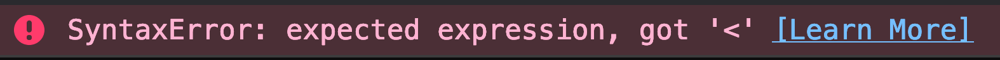

Back to React! Let's make our app be able to read live data about animals to adopt! This data is courteous of [Petfinder.com][petfinder], a wonderful service that provides a free API for adopting animals. Unfortunately, this service is USA-based, so please use USA locations only or else it won't return any results.

Please register [here][api] for an API key from Petfinder.

Create a file in the root of your project (same directory as package.json) that is called `.env`. Put this in there:

```
API_KEY=<Your API key>
API_SECRET=<Your API secret>
```

### ⚠️ IMPORTANT ⚠️

Whenever you add, remove, or change something from your .env file, you need to delete the .cache and dist directories (so that Parcel will do a clean build.) If later you're seeing you're getting unauthorized errors from the API, this is a likely culprit. If it helps, add this to your package.json and run it whenver you change your .env file before running `npm run dev` again.

If you see an error like this in your console, you're having this problem.



```json
{
  "scripts": {
    "clear-build-cache": "rm -rf .cache/ dist/"
  }
}
```

Again, it's critical to clear your build cache first, _then_ stop and start your dev server when you modify your .env file. I'm emphasizing this a lot because a lot of people get tripped up here.

Now Parcel will read these variables out of your .env file and make them available inside of your app. Now you don't have to commit secrets to your codebase and that's _always_ a good thing. If someone gets access to GitHub for your code, they won't necessarily get your API keys. You'll use a different service like [Azure Key Vault][keyvault] or [Kubernetes Secrets][kube] to manage your secrets.

Now that your secrets are in there, let's install the Petfinder Client. I wrote this little wrapper for the API; it's not good. It's optimized for this use case only. Run `npm install petfinder-client`. In App.js, add:

```javascript
// at the top
import pf from "petfinder-client";

// under imports
const petfinder = pf({
  key: process.env.API_KEY,
  secret: process.env.API_SECRET
});

// inside render method, below useDropdown calls
useEffect(() => {
  petfinder.breed.list({ animal: "dog" }).then(console.log, console.error);
});
```

- pf takes in credentials and returns an API object. You only have to give it credentials here; anywhere else you import it it'll retain the same credentials. The API response has a silly and ridiculous structure.
- Here we're using an effect to retrieve a list of breeds from the API. An effect is run after every render (which happens after state changes.) You're going to use effects to do things like AJAX calls, modify ambient state, integrate with other libraries, and many other things. Basically it's a way to delay work until after render happens and to deal with asynchronous side effects.
- If you're familiar with previous versions of React, effects can take the place of _most_ life cycle methods. In this case we're going to use it instead of `componentDidMount` and `componentDidUpdate`.

So rather just having `dog` be the static animal, let's make that dynamic and let's make it actually save the breed it gets.

```javascript
// replace effect
useEffect(() => {
  petfinder.breed.list({ animal }).then(data => {
    updateBreeds(
      Array.isArray(data.petfinder.breeds.breed)
        ? data.petfinder.breeds.breed
        : [data.petfinder.breeds.breed]
    );
  }, console.error);
}, [animal]);
```

- Due to JavaScript closures (the fact that state is preserved for various render function calls) we're able to reference updateBreeds from the outer scope. We use this to update the breed after the successful call to the petfinder API.
- Petfinder API does weird stuff where it returns an array if there are more than one breed but just returns a string if there's only one. It's dumb.
- The array at the end is peculiar but essential. By default, effects will run at the end of every re-render. This is problematic for us because we're updating breeds, which causes a re-render, which causes another effect, which causes another re-render, etc. What you can to prevent this spiral is give it an array at the end of variables as a second parameter. Now this effect will only happen if one of those variables changes. In this case, it will only cause the effect if `animal` changes. Which is exactly what we want.
- Effects are always called after the first render no matter what.

We want to console.error the messages if there's an error. Let's go turn that warning off in ESLint.

```json
{
  "rules": {
    …,
    "no-console": "warn"
  }
}
```

- It's useful to have ESLint bug you about taking console logs out but some times you do want them. Feel free to turn it off if it suits you.

Whenever a user selects a new animal, we need to programtically update the breed. Since we put this into a custom hook, we have no way to do that. Let's go make it do that. In useDropdown.js:

```javascript
// update return
return [state, Dropdown, updateState];
```

Now users can optionally programatically accept that function to update their components. Let's use this in the component. In SearchParams.js

```javascript
// replace BreedDropdown declaration
const [breed, BreedDropdown, updateBreed] = useDropdown("Breed", "", breeds);

// first line of the function inside useEffect
updateBreed("");
```

Now it updates the breed to empty whenever you change animal since you can't have a poodle cat (as cool as that sounds).

<!--

```javascript
// inside class, at top
constructor(props) {
  super(props);

  this.state = {
    pets: []
  };
}
// replace cDM
componentDidMount() {
  petfinder.pet
    .find({ location: "Seattle, WA", output: "full" })
    .then(data => {
      let pets;
      if (data.petfinder.pets && data.petfinder.pets.pet) {
        if (Array.isArray(data.petfinder.pets.pet)) {
          pets = data.petfinder.pets.pet;
        } else {
          pets = [data.petfinder.pets.pet];
        }
      } else {
        pets = []
      }
      this.setState({
        pets
      });
    });
}

// inside render, under h1
<pre>
  <code>{JSON.stringify(this.state, null, 2)}</code>
</pre>
```

- Whenever a class gets created (React or not), the constructor gets called. If you don't create a constructor, there's a default one that silently gets run in the background. Inside we accept the props from whatever parent created it and then call `super(props)` since we need to take those props and hand them to React.
- We initiate state here. We are going to be keeping an array of pet data that we load from the API. We'll initialize that as an empty array so we never have to check if that array exists or not.
- We're calling petfinder's find method. This lets us search for animals. This method requires a _location_ and an _output_. The location can be any American "<City>, <Two Letter State Abbreviation>" combination. I'll be using "Seattle, WA" but feel free to use "New York City, NY", "San Francisco, CA", or any other city that suits you. Output should always be full for our use case.
- Now, after the response comes back from the API, we call a method called `setState`. setStates takes in an object and does a shallow merge with your current state. In our case, we want to throw away the empty array and replace it with the `pet` array that we got back from the API.

* We have to do a bit of work to make sure our app doesn't barf on bad data. If there is only one pet returned, it doesn't get returned as an array, it gets returned as an object so we need to catch that and wrap it.

- Now we take that API data and output that to the DOM. Notice React is smart enough to re-render itself after a setState is called. `pre` and `code` are two tags that allow you to output that code pre-formatted.

Let' make the app use the `Pet` component we made.

```javascript
// replace render
render() {
  return (
    <div>
      <h1>Adopt Me!</h1>
      {this.state.pets.map(pet => {
        let breed;
        if (Array.isArray(pet.breeds.breed)) {
          breed = pet.breeds.breed.join(", ");
        } else {
          breed = pet.breeds.breed;
        }
        return (
          <Pet
            animal={pet.animal}
            key={pet.id}
            name={pet.name}
            breed={breed}
          />
        );
      })}
    </div>
  );
}
```

- We use [map][map] which takes a JavaScript array, takes a function, applies that function to _each_ array item (i.e. if you have an array of length 15, that function gets called 15 times,) and returns a new array containing the results of each of those function called. In `const x = [1,2,3].map(num => { return num * 2});`, `x` is `[2,4,6]`. In this case, we have an array of Pet data objects and we transform those into Pet components.
- Breed comes back as a string if it's a single breed. They come back as an array if there are multiple breeds, just like above. We need to make sure we catch that.

* Key is a unique identifier that we give React so it can do quick comparisons on objects. If we decide to change how we sort the list of pets, e.g. we sort by shelter instead of breed, we'd re-arrange all the object but they'd be the same object. All React knows is it got a new list. Without any further hinting, React would just destroy all the DOM objects and start over. If we give it a unique key for each object, it can track that an object just moved positions and didn't actually get destroyed and just move the DOM object instead of re-rendering. Big performance win.

Let's go make Pet look nicer

```javascript
import React from "react";

class Pet extends React.Component {
  render() {
    const { name, animal, breed, media, location } = this.props;
    let photos = [];
    if (media && media.photos && media.photos.photo) {
      photos = media.photos.photo.filter(photo => photo["@size"] === "pn");
    }
    return (
      <div className="pet">
        <div className="image-container">
          
        </div>
        <div className="info">
          <h1>{name}</h1>
          <h2>{`${animal} — ${breed} — ${location}`}</h2>
        </div>
      </div>
    );
  }
}

export default Pet;
```

And in App.js

```javascript
// add to what you pass to Pet
media={pet.media}
location={`${pet.contact.city}, ${pet.contact.state}`}
```

- Petfinder gives you five sizes of each image. The `pn` size is the appropriate size for what we want.


-->

&nbsp;

## 🌳 [lolcommit](https://github.com/btholt/complete-intro-to-react-5/commit/lolcommit)

**To use reset code to this commit:**

- `git checkout lolcommit -f`
- `npm install`
- Add API keys to your `.env` file
- Run `npm run dev`.

&nbsp;

[petfinder]: https://www.petfinder.com/
[api]: https://www.petfinder.com/developers/api-key
[keyvault]: https://azure.microsoft.com/en-us/services/key-vault/?WT.mc_id=react-github-brholt
[kube]: https://kubernetes.io/docs/concepts/configuration/secret/
[map]: https://developer.mozilla.org/en-US/docs/Web/JavaScript/Reference/Global_Objects/Array/map
